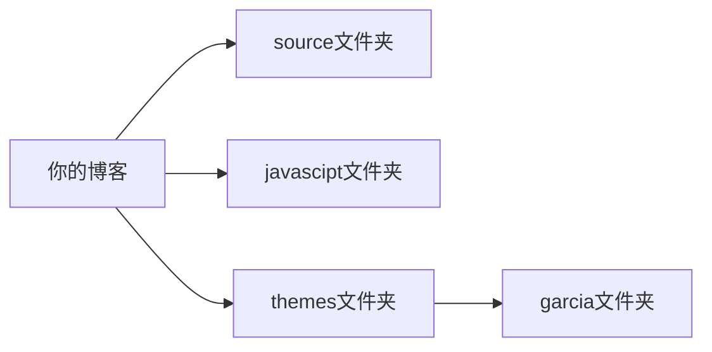

# HEXO博客主题 —— Garcia

<div style="text-align:center">


​                                       一款**个性化风格**的主题

​                               配备详尽的主题文档，支持零基础自定义二次开发

​                                        <a title="Hexo Version" target="_blank" href="https://hexo.io"></a> <a title="Hexo Version" target="_blank" href="https://hexo.io">=16.0-yellow?style=flat"></a> =9.8.0-orange?style=flat">

​                                        <a title="Hexo Version" target="_blank" href="https://hexo.io"></a> <a title="Hexo Version" target="_blank" href="https://hexo.io"></a>

​                                           预览：<a href='http://www.melifen.top'>梅里芬的博客</a>

<div>

## 快速开始

### 1.搭建Hexo博客

如果你还没有Hexo博客，请按照 <a href='https://hexo.io/zh-cn/docs/index.html'>hexo官方文档</a> 进行安装、建站。

### 2.获取主题并安装

Hexo版本**6.0**及以上，clone本项目到本地，如果需要解压请先进行解压，然后将解压后的文件夹，移至Hexo博客中themes文件夹中，如下图所示：



### 3.指定主题

如下修改 Hexo 博客根目录中的 ` _config.yml` 文件：

```yaml
# Extensions
## Plugins: https://hexo.io/plugins/
## Themes: https://hexo.io/themes/
theme: garcia 
```

设置完成后刷新即可看到部分**默认样式**

## Docs文档

```yaml
# html lang
language: en  # zh-CN 语言

# main menu navigation 可以通过修改这个来修改导航栏
menu:
  首页: /        # 导航栏首选项
  关于: /about   # 导航栏第二选项
  分享: /sharing # 导航栏第三选项
  项目: /projects # 导航栏第四选项
  归档: /archives # 导航栏第五选项

head:
  title: 我的博客  # 背景标题  
  favicon: /images/logo_garcia.jpg  # 网站图标地址，放在主题目录下source的images文件夹中
  keywords: garcia                  # 网站关键词             
  backgroundImg: /images/bg-1.jpg   # 网站背景图片地址，放在主题目录下source的images文件夹中

# stylesheets loaded in the <head>
stylesheets: #  网站样式
  - /css/garcia.css
  - /css/home-bg.css
  - /css/menu.css
  - /css/recent-posts.css
  - /css/bottom.css
  - /css/category.css
  - /css/archive.css
  - /css/about.css
  - /css/post.css
  - /css/sharing.css
  - /css/projects.css

# scripts loaded in the end of the body
scripts: # 网站脚本（基本是js动画）
  - /js/garcia.js
  - /js/header.js
  - /js/post_item.js


#个人信息卡片配置
userinfo:
  name: Garcia #姓名
  description: I LOVE THIS THEME. #个人描述
  avator: /images/logo_garcia.jpg #形象图片
  github: https://github.com/Melifen #github链接
  email: mailto:melifen2002@163.com #mailto:your_email

#分享链接配置
sharing:
  sharing_1:
    url:   # 分享链接
    title:   # 分享标题
    cover:  # 分享封面
    position:   # 分享封面位置

# 我的项目配置
projects:
  project_1:  
    url:   # 项目链接
    title:  # 项目标题
    cover:   # 项目封面
    position:   # 项目封面位置
```

- ### 创建个人简介页

在 Hexo 博客**根目录**下source里面新建一个命名为 **about** 的文件夹，添加md文件后,刷新页面即可。

个人简介非配置项，用 **markdown** 进行编写即可。

- ### 创建分享页

在 Hexo 博客**根目录**下source里面新建一个命名为 **sharing** 的文件夹，添加md文件后在**主题配置文件**中进行配置即可，如下：

```yaml
sharing:
  sharing_1:
    url: https://wangdoc.com/  # 分享链接
    title: 网道  # 分享标题
    cover: https://melibees-images.oss-cn-hangzhou.aliyuncs.com/images/20230905150914.png # 分享封面
    position: left  # 分享封面位置
```

- ### 创建项目页

在 Hexo 博客**根目录**下 **source** 里面新建一个命名为 **projects** 的文件夹，添加md文件后在**主题配置文件**中进行配置即可，对应配置如下：

```
projects:
  project_1:  
    url:  # 项目链接
    title:  # 项目标题
    cover:  # 项目封面
    position: center  # 项目封面位置
```

## 功能特性

- [x] 丝滑的动画
- [x] 完善的文档
- [ ] 组件懒加载
- [ ] 代码高亮
- [ ] 支持暗色模式
- [ ] 内置评论插件
- [ ] 支持文章搜索
- [ ] 支持 LaTex 数学公式
- [ ] 支持 mermaid 流程图

## 贡献者

<div style="height:100px;width:100px;overflow:hidden;border-radius:100px;"></div>

## 联系方式

📮melifen2002@163.com
